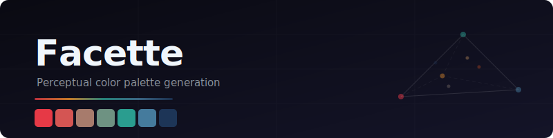
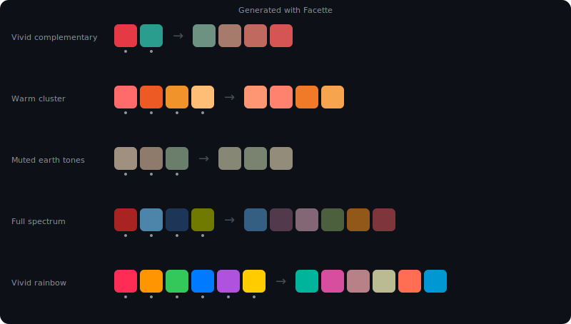
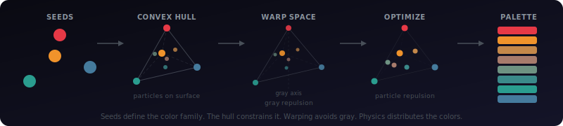

<p align="center">
  
</p>

Perceptual color palette generation. Give it a few seed colors and a target size, and it produces a palette where every color is visually distinct and belongs to the same chromatic family.

<p align="center">
  
</p>

## How it works

Facette treats palette generation as a physics simulation: colors are particles on the convex hull of your seeds in a radially lifted OKLab space, repelling each other until they reach maximum separation. The lift contracts the low-chroma region so particles naturally avoid muddy grays, and its convexity guarantees chroma preservation on intermediate colors between vivid seeds.

<p align="center">
  
</p>

The algorithm handles everything automatically: 2 seeds produce a gradient, 3+ seeds define a surface, and the convex hull geometry adapts to any configuration — vivid, muted, narrow hue range, or full spectrum.

## Installation

```bash
npm install facette
```

## Usage

```ts
import { generatePalette } from 'facette';

const result = generatePalette(
  ['#e63946', '#457b9d', '#1d3557'],  // seed colors
  8                                     // palette size
);

console.log(result.colors);
// ['#e63946', '#457b9d', '#1d3557', '#7b2d3e', '#2e6a85', ...]
```

### Options

```ts
const result = generatePalette(seeds, 8, {
  vividness: 0.06,  // 0 = auto (default), range [0.005, 0.10]
  gamma: 1.5,       // chroma preservation strength, >= 1 (default: 1)
});
```

- **`vividness`** — controls how aggressively the algorithm avoids low-chroma colors. Higher values push the palette toward more saturated colors. At `0` (default), it adapts automatically based on how vivid your seeds are.
- **`gamma`** — controls chroma preservation on intermediate colors between vivid seeds. At `1` (default), the algorithm uses standard gray avoidance. Values above `1` (e.g. `1.5`–`2`) produce stronger outward bowing of the hull surface in OKLab, keeping midpoint colors more vivid. Useful for palettes with vivid seeds at wide hue separations.

### Debug / visualization API

For inspecting the optimization process:

```ts
import { createPaletteStepper } from 'facette';

const stepper = createPaletteStepper(['#e63946', '#457b9d', '#1d3557'], 8);

// Step through the optimization frame by frame
for (const frame of stepper.frames()) {
  console.log(`Iteration ${frame.iteration}: energy=${frame.energy.toFixed(4)}, minDeltaE=${frame.minDeltaE.toFixed(4)}`);
}

// Or get everything at once
const trace = stepper.run();
console.log(trace.finalColors);       // hex strings
console.log(trace.frames.length);     // number of iterations
console.log(trace.geometry.kind);     // 'line' or 'hull'
```

## Debug Dashboard

The repo includes a web-based debug dashboard for visualizing the algorithm:

```bash
git clone <repo-url>
cd Facette
pnpm install
pnpm turbo dev
```

Then open `http://localhost:5173`. The dashboard shows:

- **Dual 3D views** — OKLab (Cartesian) and OKLCh (cylindrical) side by side
- **Optimization playback** — watch particles repel each other frame by frame
- **Lift morph** — toggle smoothly between OKLab and lifted space to see how the radial lift reshapes the space
- **sRGB gamut boundary** — see the shape of displayable colors
- **Point inspector** — click any point to see its OKLab, OKLCh, lifted coordinates, and sRGB values
- **Interactive seeds** — add, remove, or change seed colors and regenerate live

## API Reference

### `generatePalette(seeds, size, options?)`

| Parameter | Type | Description |
|-----------|------|-------------|
| `seeds` | `string[]` | Hex colors (e.g. `['#ff0000', '#0000ff']`). Minimum 2, must be distinct. |
| `size` | `number` | Total palette size including seeds. Must be >= seed count. |
| `options.vividness` | `number` | Gray avoidance strength. `0` = auto. Range `[0.005, 0.10]`. |
| `options.gamma` | `number` | Chroma preservation strength. Default `1`. Must be `>= 1`. |

**Returns** `PaletteResult`:

```ts
{
  colors: string[];       // hex sRGB colors
  seeds: string[];        // input seeds echoed back
  metadata: {
    minDeltaE: number;    // minimum pairwise perceptual distance
    iterations: number;   // optimization steps taken
    clippedCount: number; // colors that needed gamut clipping
  };
}
```

### `createPaletteStepper(seeds, size, options?)`

Same parameters as `generatePalette`. Returns a `PaletteStepper`:

```ts
{
  geometry: Geometry;                      // hull or line segment topology
  seeds: Particle[];                       // classified seed particles
  frames(): Generator<OptimizationFrame>;  // iterate frame by frame
  run(): OptimizationTrace;                // run to completion
}
```

## How the algorithm works (brief)

1. **Parse seeds** — convert hex to OKLab
2. **Radial lift** — apply the convex transform `rho(r) = R * (f(r)/f(R))^gamma` that contracts the low-chroma region, preserves hue, and anchors max-chroma seeds as fixed points
3. **Detect dimensionality** — SVD on lifted seeds determines if they are collinear (1D), coplanar (2D), or full 3D
4. **Build geometry** — convex hull (2D/3D) or line segment (1D) from lifted seeds. Faces are flat in lifted space, so areas are exact.
5. **Initialize particles** — greedy placement weighted by exact face area in lifted space
6. **Optimize** — plain Euclidean Riesz repulsion (exponent ramps from 2 to 6), constrained to the hull surface in lifted space. Gamut penalty via finite differences through the inverse lift.
7. **Output** — inverse-lift back to OKLab, gamut-clip, convert to sRGB hex

The full algorithm specification is in [`Specs/Facette_algorithm_v5.md`](Specs/Facette_algorithm_v5.md).

## License

MIT
