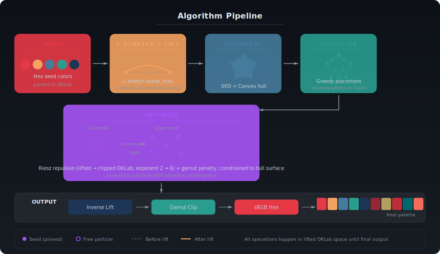
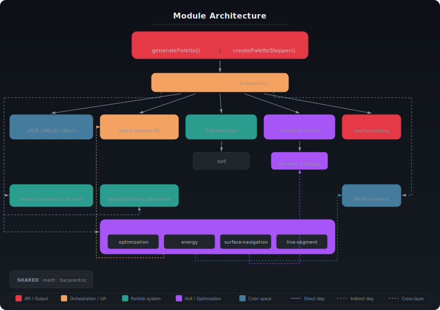

<p align="center">
  
</p>

Perceptual color palette generation. Give it a few seed colors and a target size, and it produces a palette where every color is visually distinct and belongs to the same chromatic family.

<p align="center">
  
</p>

## How it works

Facette treats palette generation as a physics simulation: colors are particles on the convex hull of your seeds in a radially lifted OKLab space, repelling each other until they reach maximum separation. The lift contracts the low-chroma region so particles naturally avoid muddy grays, and its convexity guarantees chroma preservation on intermediate colors between vivid seeds.

<p align="center">
  
</p>

The algorithm handles everything automatically: 2 seeds produce a gradient, 3+ seeds define a surface, and the convex hull geometry adapts to any configuration — vivid, muted, narrow hue range, or full spectrum.

## Installation

```bash
npm install facette
```

## Usage

```ts
import { generatePalette } from 'facette';

const result = generatePalette(
  ['#e63946', '#457b9d', '#1d3557'],  // seed colors
  8                                     // palette size
);

console.log(result.colors);
// ['#e63946', '#457b9d', '#1d3557', '#7b2d3e', '#2e6a85', ...]
```

### Options

```ts
const result = generatePalette(seeds, 8, {
  vividness: 2,    // 0–4, default 2. Controls adaptive chroma preservation.
  spread: 1.5,     // 1–5, default 1.5. Lightness range expansion.
});
```

- **`vividness`** — controls how strongly the algorithm preserves chroma on intermediate colors between seeds at wide hue separations. The algorithm computes γ (convexity strength) adaptively from the seed hue configuration: `γ = 1 + vividness × Δh_max / π`. At `0`, no adaptive chroma preservation (γ = 1 always). At `2` (default), moderate adaptation — complementary seeds get γ = 3, narrow-hue seeds get γ ≈ 1. Higher values produce more aggressive chroma preservation.
- **`spread`** — controls how much the palette's lightness range extends beyond the seeds. At `1` (no stretching), colors stay within the seed lightness range. At `1.5` (default), a 50% expansion. At `5`, the lightness range is quintupled.

### Debug / visualization API

For inspecting the optimization process:

```ts
import { createPaletteStepper } from 'facette';

const stepper = createPaletteStepper(['#e63946', '#457b9d', '#1d3557'], 8);

// Step through the optimization frame by frame
for (const frame of stepper.frames()) {
  console.log(`Iteration ${frame.iteration}: energy=${frame.energy.toFixed(4)}, minDeltaE=${frame.minDeltaE.toFixed(4)}`);
}

// Or get everything at once
const trace = stepper.run();
console.log(trace.finalColors);       // hex strings
console.log(trace.frames.length);     // number of iterations
console.log(trace.geometry.kind);     // 'line' or 'hull'
```

## Debug Dashboard

The repo includes a web-based debug dashboard for visualizing the algorithm:

```bash
git clone <repo-url>
cd Facette
pnpm install
pnpm turbo dev
```

Then open `http://localhost:5173`. The dashboard shows:

- **Dual 3D views** — OKLab (Cartesian) and OKLCh (cylindrical) side by side
- **Optimization playback** — watch particles repel each other frame by frame
- **Lift morph** — toggle smoothly between OKLab and lifted space to see how the radial lift reshapes the space
- **sRGB gamut boundary** — see the shape of displayable colors
- **Point inspector** — click any point to see its OKLab, OKLCh, lifted coordinates, and sRGB values
- **Interactive seeds** — add, remove, or change seed colors and regenerate live

## API Reference

### `generatePalette(seeds, size, options?)`

|Parameter|Type|Description|
|---------|----|-----------|
|`seeds`|`string[]`|Hex colors (e.g. `['#ff0000', '#0000ff']`). Minimum 2, must be distinct.|
|`size`|`number`|Total palette size including seeds. Must be >= seed count.|
|`options.vividness`|`number`|Adaptive gamma coefficient. Default `2`. Range `[0, 4]`.|
|`options.spread`|`number`|Lightness range expansion. Default `1.5`. Range `[1, 5]`.|

**Returns** `PaletteResult`:

```ts
{
  colors: string[];       // hex sRGB colors
  seeds: string[];        // input seeds echoed back
  metadata: {
    minDeltaE: number;    // minimum pairwise perceptual distance
    iterations: number;   // optimization steps taken
    clippedCount: number; // colors that needed gamut clipping
  };
}
```

### `createPaletteStepper(seeds, size, options?)`

Same parameters as `generatePalette`. Returns a `PaletteStepper`:

```ts
{
  geometry: Geometry;                      // hull or line segment topology
  seeds: Particle[];                       // classified seed particles
  frames(): Generator<OptimizationFrame>;  // iterate frame by frame
  run(): OptimizationTrace;                // run to completion
}
```

## How the algorithm works (brief)

1. **Parse seeds** — convert hex to OKLab
2. **L-stretch + Space lift** — expand seed lightness values around their median (controlled by `spread`), then apply the radial lift `ρ(r) = R × (f(r)/f(R))^γ` which contracts the low-chroma region, preserves hue, and anchors max-chroma seeds. γ is computed adaptively from seed hue spread via the `vividness` parameter.
3. **Detect dimensionality** — SVD on lifted seeds determines if they are collinear (1D), coplanar (2D), or full 3D
4. **Build geometry** — convex hull (2D/3D) or line segment (1D) from lifted seeds. Faces are flat in lifted space, so areas are exact.
5. **Initialize particles** — greedy placement weighted by exact face area in lifted space
6. **Optimize** — plain Euclidean Riesz repulsion (exponent ramps from 2 to 6), constrained to the hull surface in lifted space. Gamut penalty via finite differences through the inverse lift.
7. **Output** — inverse-lift back to OKLab, gamut-clip, convert to sRGB hex

The full algorithm specification is in [`Specs/Facette_algorithm_v5.1.md`](Specs/Facette_algorithm_v5.1.md).

## Architecture

Facette is built as a modular pipeline where each stage has a single, well-defined job. Think of it like an assembly line: raw seed colors enter one end, pass through a series of transformations, and emerge as a complete palette at the other.

<p align="center">
  
</p>

### The pipeline, stage by stage

**1. Input** — Your hex colors (e.g. `#e63946`) are parsed into [OKLab](https://bottosson.github.io/posts/oklab/), a perceptually uniform color space where equal distances correspond to equal visual differences. This is the foundation that makes "visually distinct" a measurable quantity.

**2. L-Stretch & Space Lift** — OKLab is great, but it has a problem: the center of the space (low chroma) is where all the muddy, washed-out grays live. First, seed lightness values are expanded around their median (controlled by `spread`), giving new colors room to extend beyond the seed lightness range. Then the radial space lift pushes the low-chroma region inward. The radial transform is carefully designed so your original seed colors stay exactly where they are — only the space between them changes. The convexity strength γ adapts automatically to your seeds' hue configuration: narrow-hue palettes get gentle treatment (γ ≈ 1), while wide-hue palettes get aggressive chroma preservation (γ up to 3). The `vividness` parameter controls this sensitivity.

**3. Geometry** — Now that we're in lifted space, the algorithm figures out the shape your seeds define. Two seeds define a line. Three or more seeds that happen to lie in a plane define a flat polygon. Otherwise, they define a 3D volume. In each case, Facette computes the [convex hull](https://en.wikipedia.org/wiki/Convex_hull) — the smallest shape that encloses all seeds. This hull becomes the surface that new colors are constrained to, which guarantees they stay within the chromatic family of your seeds.

Under the hood, this step uses [Singular Value Decomposition](https://en.wikipedia.org/wiki/Singular_value_decomposition) (SVD) to detect dimensionality, then runs either a line-segment construction, a 2D convex hull (Graham scan), or a 3D convex hull (QuickHull) depending on the result.

**4. Initialize** — Free particles (the new colors to generate) are placed on the hull surface using a greedy strategy. The algorithm picks the face with the most available space, samples a grid of candidate positions on that face, and selects the point that is farthest from all existing particles. This gives the optimizer a strong starting position rather than random noise.

**5. Optimize** — This is where the physics simulation happens. Every particle exerts a repulsive force on every other particle (like electrons on a sphere), pushing them apart until they reach maximum separation. The forces use [Riesz energy](https://en.wikipedia.org/wiki/Riesz_potential) with an exponent that gradually ramps from 2 to 6 — starting soft for global exploration and ending sharp to fine-tune local spacing. Meanwhile, a gamut penalty nudges particles away from colors that would fall outside the displayable sRGB range. An annealing schedule controls step sizes and convergence.

Throughout optimization, every particle is constrained to the hull surface. When a force pushes a particle off the edge of a triangle face, the algorithm detects the crossing and seamlessly transitions it to the adjacent face.

**6. Output** — Final positions are inverse-lifted back to OKLab, gamut-clipped to ensure every color is displayable, and converted to hex strings. The result includes metadata like the minimum perceptual distance between any two colors (`minDeltaE`), iteration count, and how many colors needed clipping.

### Module structure

The codebase follows a strict separation of concerns — each file owns exactly one responsibility and exposes a narrow interface.

<p align="center">
  
</p>

| Module | Role |
|--------|------|
| `facette.ts` | Orchestrator — wires everything together, validates input, computes parameters |
| `color-conversion.ts` | sRGB / OKLab / OKLCh transforms (Ottosson matrices) |
| `adaptive-gamma.ts` | Pure function: computes adaptive γ from seed hue spread and vividness |
| `space-lift.ts` | Radial chroma lift with exact closed-form inverse (L-stretch is seed preprocessing in facette.ts) |
| `dimensionality.ts` | SVD-based detection of whether seeds span 1D, 2D, or 3D |
| `convex-hull.ts` | Builds the constraint surface (line, 2D polygon, or 3D hull) |
| `atlas.ts` | Lazy-cached index of face bases, areas, and adjacency topology |
| `seed-classification.ts` | Tags each seed as vertex / boundary / interior on the hull |
| `initialization.ts` | Greedy area-weighted particle placement |
| `optimization.ts` | Generator-based solver loop with annealing schedule |
| `energy.ts` | Riesz repulsion + gamut penalty force computation |
| `surface-navigation.ts` | Projects motion onto hull faces, handles edge crossings |
| `line-segment.ts` | 1D constraint for the two-seed case |
| `gamut-clipping.ts` | Binary-search chroma reduction to sRGB boundary |
| `output.ts` | Formats final colors as hex, tracks clipped count |

Shared utilities (`math.ts`, `barycentric.ts`, `svd.ts`, `types.ts`) provide vector/matrix primitives and type definitions.

### Key design decisions

- **Dependency injection** — The optimizer receives its force computer and motion constraint as arguments, not hardcoded imports. This makes each piece independently testable and swappable.
- **Generator pattern** — The optimization loop is a generator that yields frames one at a time. The public `createPaletteStepper` API lets you step through the optimization frame by frame (for visualization) or run it to completion — same code path, no duplication.
- **Discriminated unions** — Particles are tagged (`pinned-vertex`, `free`, `pinned-endpoint`, etc.) so TypeScript enforces exhaustive handling everywhere a particle's role matters.
- **Lazy caching** — The atlas computes face bases and areas on first access and caches them, avoiding redundant linear algebra across thousands of optimizer iterations.

## License

MIT
